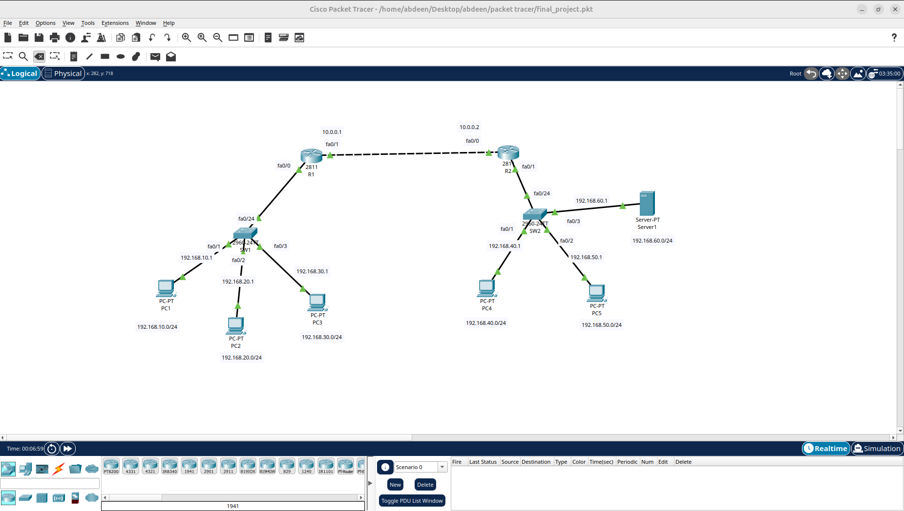

# Enterprise Network Design (OSPF & ACLs)

This project features a comprehensive network topology designed in **Cisco Packet Tracer**. It simulates an enterprise environment with secure segmentation and dynamic routing.

## Technical Configuration
- **Routing Protocol:** OSPF (Open Shortest Path First) for dynamic inter-router connectivity.
- **Security:** Extended Access Control Lists (ACLs) to secure the Server Farm.
- **VLANs:** Departmental isolation using VLANs and Inter-VLAN routing.
- **Redundancy:** Structured switching for network stability.

## Topology Diagram

## Files
- `final_project.pkt`: The source lab file.
